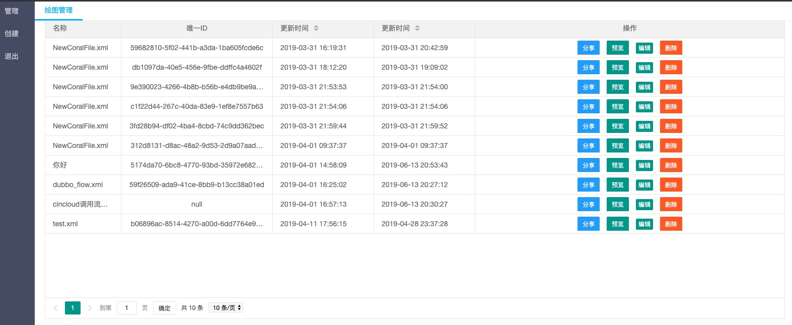
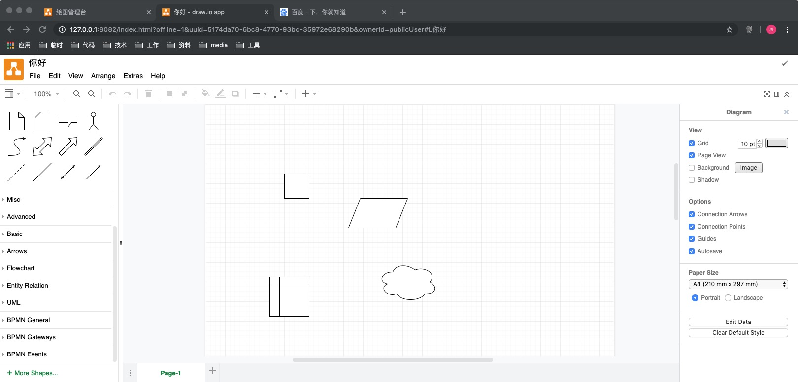

##### coral-draw介绍
    采用技术
        drawio
        springboot
        springboot-jpa
        mysql
        
##### 功能列表
    已具备:
        1.集成drawio，支持绘图服务端同步
        2.增加用户体系，支持个人用户体系文件
        3.增加publicUser，公有文件绘图体系
    
    TODO:
        1.偷懒中文名还有点问题
        2.主页面没有权限认证
        3.删除功能缺少
        4.缺少组织模块
        5.多个page页加载存在问题，未找到原因
      
##### 本地运行
    依赖mysql、需创建数据库
    http://127.0.0.1:8082/index.html?offline=1&uuid=8b4e7ef9-2757-48da-a8dc-d97f0e0a1b4d&ownerId=1554041140849d3VoYW90eA#LNewCoralFile.xml
    http://127.0.0.1:8082/index.html?lightbox=1&highlight=0000ff&edit=_blank&layers=1&nav=1&uuid=8b4e7ef9-2757-48da-a8dc-d97f0e0a1b4d
    http://127.0.0.1:8082/index.html?offline=1&uuid=8b4e7ef9-2757-48da-a8dc-d97f0e0a1b4d&ownerId=1554041140849d3VoYW90eA#LNewCoralFile.xml
        
##### 功能截图

主页面

绘图界面

