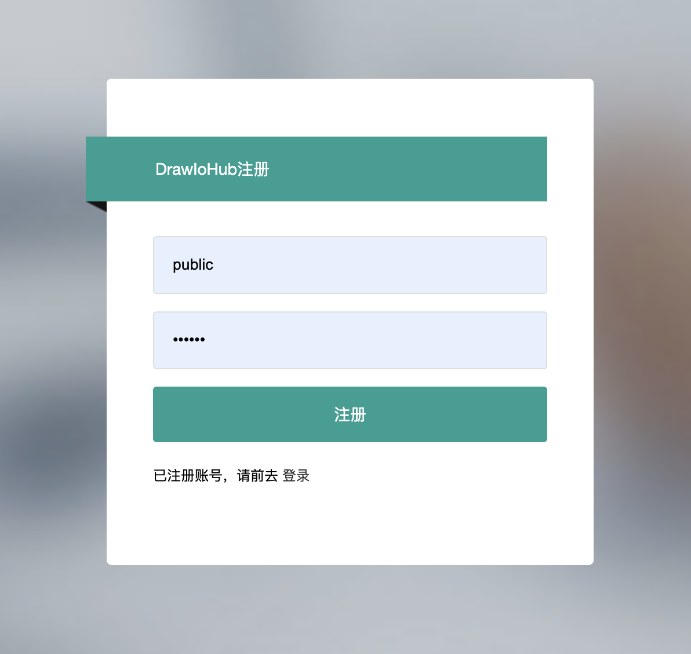
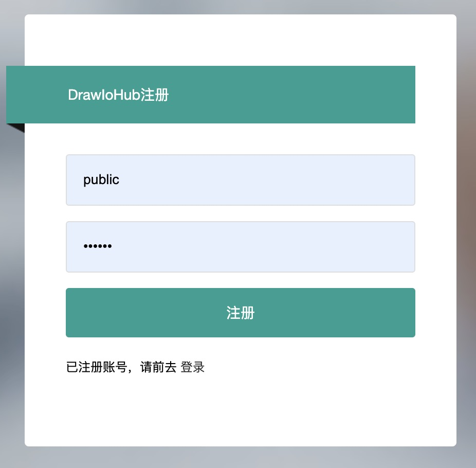
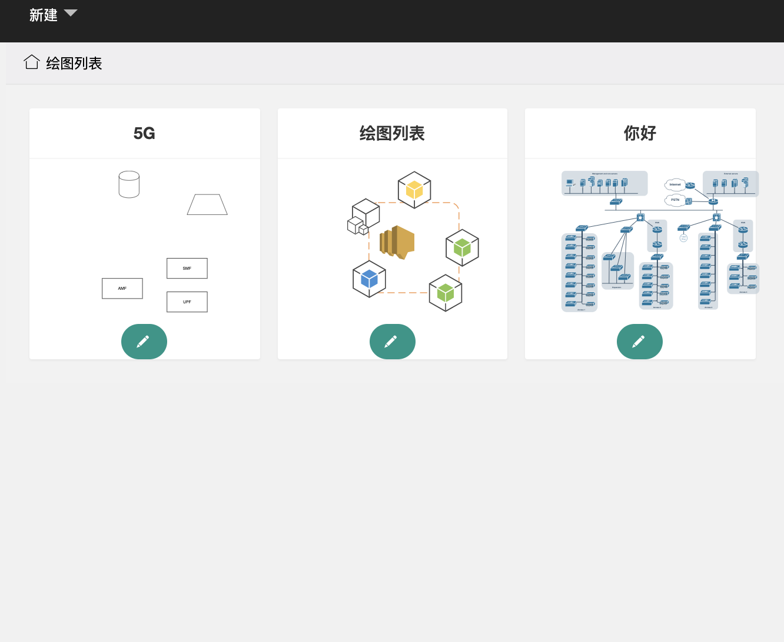
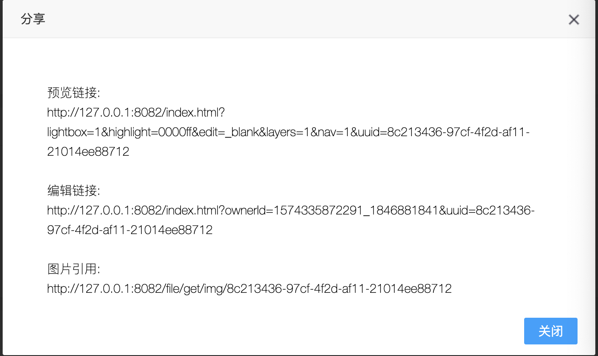
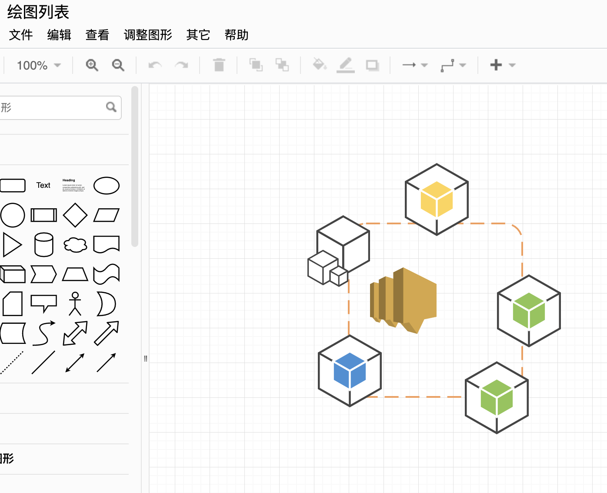

### 1.DrawIohHub介绍

drawio数据服务端同步，采用浏览器存储模式自动同步

### 2.项目引用
* drawio
    ant编译
* springboot
    服务端数据处理
* mysql
    数据存储

### 3.docker部署
* step1 安装docker环境


* step2 创建数据环境

```
docker stop coral-drawhubdb
docker rm coral-drawhubdb
docker run -d --name coral-drawhubdb -p 3307:3306 wuhaocn/mysqldrawdb:5.6.40
docker update coral-drawhubdb --restart=always
```

* step3 创建数据库 
  
  数据库工具连接创建：DrawDB [user:root pwd:coral@2018],[数据库表自动生成]【重要】
  
* step4  安装服务

```
docker stop coral-drawhub
docker rm coral-drawhub
docker run --privileged=true \
           -p 8082:8082 \
           -d --name coral-drawhub \
           --env DB_HOST='10.3.4.111:3307' \
           wuhaocn/coral-drawhub:3.0.0-2109141820
docker update coral-drawhub --restart=always

docker logs -f coral-drawhub
```

*  step5 验证服务

访问http://10.3.4.111:8082/

### 4.示例界面
 * 注册

 * 登录

 * 绘图列表

 * 绘图分享

 * 绘图编辑

 
